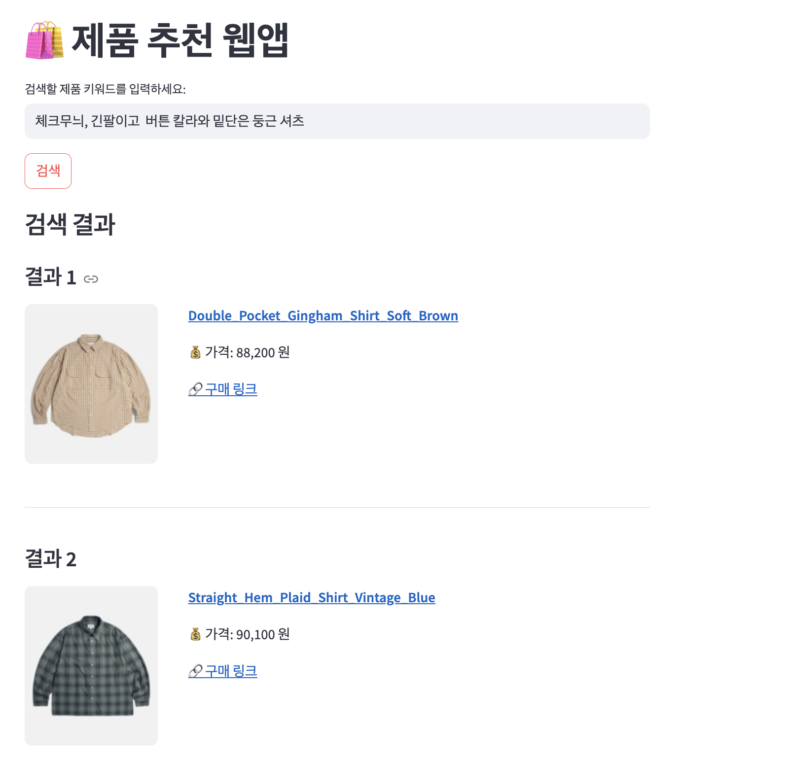
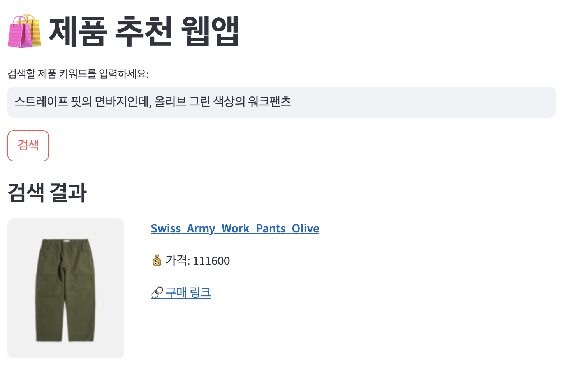

# Clothing Retrieval Demo Prototype

이 데모는 **텍스트 입력을 통해 원하는 옷(의류)을 추출하는 Retrieval Service Prototype**입니다.  
Streamlit을 기반으로 간단하게 구현되어 있으며, 사용자 인터랙션 없이 데모용으로 구성되어 있습니다.

## 데모 설명

- **텍스트 기반 추출:**  
  입력한 텍스트(예: "캐주얼 여름 셔츠")를 분석하여 관련 옷을 추천하는 기능을 시연합니다.

- **Streamlit 인터페이스:**  
  간단한 웹 UI를 통해 텍스트 입력과 결과 출력을 확인할 수 있습니다.

## 예시 입력 및 결과 화면

아래는 서비스에서 예시로 입력한 텍스트와 그에 따른 결과 화면입니다:

### 예시 1
입력: **"파란색과 흰색 체크무늬, 긴팔이고 버튼 칼라와 밋밋한 등근 셔츠"**

---

### 예시 2
입력: **"스트레이트 핏의 밀리터리 팬츠인데, 올리브 그린 색상의 워크팬츠"**

